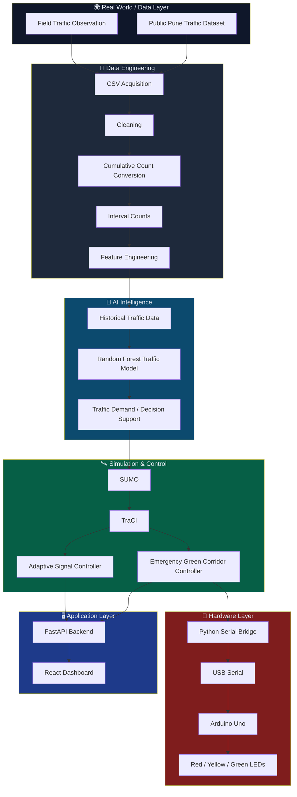
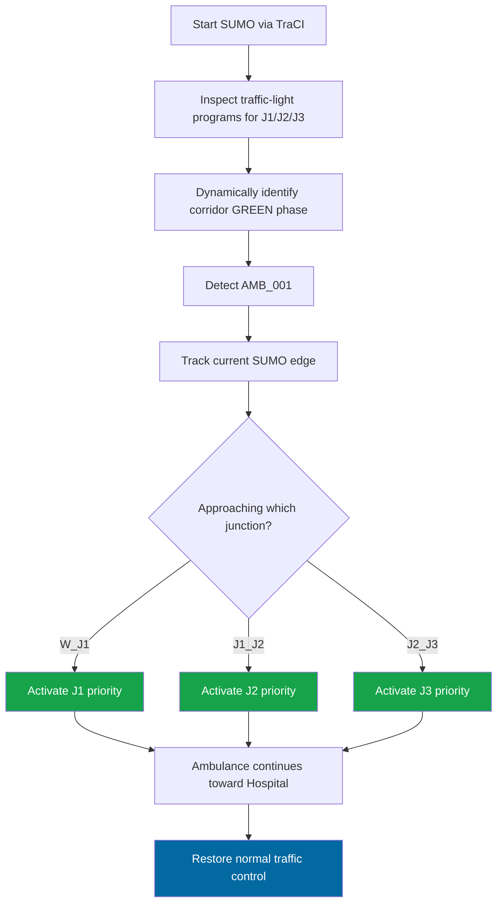
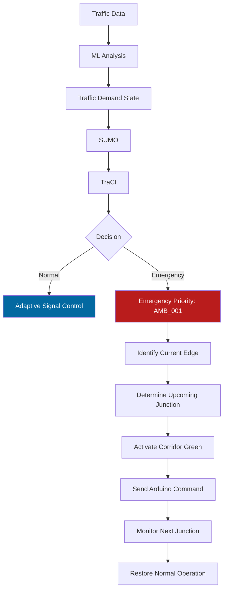

<div align="center">

# 🚦 SmartTrafficAI

### AI-Powered Adaptive Traffic & Emergency Mobility Management System

**Traffic Intelligence • Machine Learning • SUMO • TraCI • FastAPI • React • Arduino**

[](https://www.python.org/)
[](https://fastapi.tiangolo.com/)
[](https://react.dev/)
[](https://eclipse.dev/sumo/)
[](https://www.arduino.cc/)
[](#-machine-learning)
[](#-implementation-status)
[](#-academic--design-thinking-value)

A student-scale intelligent transportation prototype that transforms traffic data into adaptive signal decisions and creates a multi-junction emergency green corridor — evaluated end-to-end in controlled SUMO simulation.

</div>

---

## 📊 Project at a Glance

> All figures below are measured outcomes from **controlled SUMO simulation experiments** — not live-road or municipal deployment metrics.

<div align="center">

| 🚗 Avg. Queue Reduction | 🚑 Ambulance Travel-Time Reduction | ⏱️ Ambulance Waiting-Time Reduction | 📉 Ambulance Time-Loss Reduction | 🚦 Corridor Junctions | 🧪 Vehicles Evaluated |
|:---:|:---:|:---:|:---:|:---:|:---:|
| **69.73%** | **30.30%** | **100%** | **67.81%** | **3 (J1–J3)** | **401** |

</div>

---

## 🧭 Project Summary

**SmartTrafficAI** is an AI-assisted intelligent traffic-management prototype that combines real-world traffic observation, public traffic data, machine learning, microscopic traffic simulation, and physical hardware prototyping into a single, coherent mobility system.

The project spans five integrated layers:

- **Data & AI** — public Pune traffic data, preprocessing, and a Random Forest traffic-analysis workflow
- **Simulation & Control** — Eclipse SUMO + TraCI for fixed-time vs adaptive signal control experiments
- **Emergency Mobility** — a multi-junction (J1 → J2 → J3) SUMO green corridor for ambulance priority
- **Application Layer** — a FastAPI backend and a React/Vite monitoring dashboard
- **Hardware Layer** — an Arduino Uno physical traffic-signal prototype driven over USB serial

SmartTrafficAI is designed to be evaluated as an **end-to-end intelligent mobility prototype**, not merely a dashboard or a single ML model.

---

## ❗ Problem Statement

Conventional fixed-time traffic signals operate on predetermined cycles and cannot continuously adapt to changing real-time traffic demand. This produces a set of recurring, measurable inefficiencies:

- Unnecessary waiting at red signals even when a direction has no conflicting traffic
- Long, growing vehicle queues during demand surges
- Increased average travel time and journey unpredictability
- Poor allocation of green time across competing approaches
- Congestion that worsens as conditions change through the day
- Emergency vehicles (ambulances, fire trucks) delayed at intersections that have no awareness of their approach
- No coordinated priority mechanism across *multiple* consecutive junctions, so even a single successful green at one junction can be undone by a red at the next

This problem is well-suited to a data/AI-driven prototype because it is:

| Property | Why it applies |
|---|---|
| **Observable** | Queue buildup and signal-wait delay are directly visible at any signalised junction |
| **Recurring** | The same congestion and emergency-delay patterns repeat daily |
| **Measurable** | Queue length, waiting time, travel time, and time loss can all be quantified |
| **Bounded** | A junction or short corridor is a tractable, well-defined control problem |
| **AI/data-tractable** | Historical traffic counts and simulated traffic states can be modeled and acted on programmatically |

SmartTrafficAI is proposed as a research-scale prototype that demonstrates how AI-informed, simulation-validated adaptive control can address these problems.

---

## 💡 Proposed Solution

**General flow:**

```
Traffic Observation + Public Traffic Dataset
        ↓
Preprocessing
        ↓
Feature Engineering
        ↓
ML Traffic Analysis / Prediction
        ↓
SUMO Traffic Simulation
        ↓
TraCI Adaptive Control
        ↓
Decision Logic
        ↓
FastAPI + React Dashboard
        ↓
Physical Arduino Signal Prototype
```

**Emergency corridor flow:**

```
Ambulance Detection (AMB_001)
        ↓
Determine Current Corridor Edge
        ↓
Activate Upcoming Signal
        ↓
J1 GREEN → J2 GREEN → J3 GREEN
        ↓
Hospital
        ↓
Restore Normal Signal Operation
```

---

## 🎯 Objectives

1. Analyse traffic-volume and congestion patterns from real/public data.
2. Preprocess raw traffic datasets into analysis-ready form.
3. Develop an ML-based traffic prediction/analysis workflow.
4. Simulate realistic traffic behaviour using SUMO.
5. Compare fixed-time and adaptive signal control strategies.
6. Reduce vehicle queues through adaptive control.
7. Reduce average waiting and travel time.
8. Detect and track an emergency vehicle inside the simulation.
9. Provide sequential emergency priority across multiple intersections (J1 → J2 → J3).
10. Visualise system behaviour through a React monitoring dashboard.
11. Expose traffic and emergency intelligence through a FastAPI backend.
12. Build an Arduino-based physical traffic-signal actuation prototype.
13. Maintain responsible, safe, and clearly-scoped prototype boundaries.

---

## 🧠 Design Thinking Workflow


| Stage | Description |
|---|---|
| **Empathise** | Real traffic conditions were observed to understand recurring congestion and emergency-mobility difficulties at signalised junctions. |
| **Define** | The core problem was defined as inefficient static signal timing combined with a lack of coordinated emergency-vehicle priority across intersections. |
| **Ideate** | Solutions explored included AI-based traffic analysis, adaptive TraCI-driven signal timing, a SUMO-based multi-junction green corridor, a monitoring dashboard, and physical hardware actuation. |
| **Prototype** | The above ideas were implemented as an integrated software + simulation prototype. |
| **Deliver** | A working prototype was delivered: data pipeline, ML workflow, SUMO experiments, FastAPI backend, React dashboard, and an Arduino hardware-actuation layer prepared for physical validation. |

---

## 🏗️ System Architecture



**Layer summary:**

| Layer | Role |
|---|---|
| **Data Layer** | Combines field observation context with the public Pune traffic dataset as raw input. |
| **Data Engineering** | Cleans raw CSVs, resolves cumulative counters into interval-based vehicle counts, and engineers features for modelling. |
| **AI Intelligence** | A Random Forest model trained on processed traffic data supports traffic-demand analysis. |
| **Simulation & Control** | SUMO provides a microscopic traffic environment; TraCI lets Python programmatically read and modify traffic-light state for both adaptive control and emergency priority. |
| **Application Layer** | FastAPI exposes traffic/emergency information; the React dashboard visualises it. |
| **Hardware Layer** | The emergency controller's decisions are mirrored to a Python serial bridge, which (when hardware is connected) drives an Arduino Uno and physical LED traffic signal. |

---

## 🧰 Technology Stack

| Category | Technologies | Purpose |
|---|---|---|
| **AI & Data** | Python, Pandas, NumPy, Scikit-learn, Random Forest, Joblib, Jupyter Notebook | Data processing, feature engineering, and traffic prediction/analysis |
| **Simulation** | Eclipse SUMO, TraCI | Microscopic traffic simulation and runtime signal control |
| **Backend** | FastAPI, Uvicorn, Python REST API | Serving traffic and emergency intelligence to clients |
| **Frontend** | React, Vite, JavaScript, Lucide React | Interactive monitoring dashboard |
| **Hardware** | Arduino Uno, Breadboard, Red/Yellow/Green LEDs, Resistors, Jumper wires, USB Serial, PySerial | Physical traffic-signal actuation prototype |
| **Development** | Git, GitHub, VS Code, Python venv | Version control and reproducible development environment |

> ⚠️ The implemented hardware controller is an **Arduino Uno** communicating over **USB Serial (PySerial)**. ESP32 and Wi‑Fi are **not** part of the current implementation.

---

## 🤔 Why These Technologies?

| Technology | Justification |
|---|---|
| **Python** | One ecosystem for data science, ML, SUMO/TraCI scripting, FastAPI, and serial communication. |
| **Random Forest** | A strong, interpretable baseline for structured/tabular traffic data with nonlinear relationships and feature interactions. |
| **SUMO** | Open-source microscopic traffic simulator suited to junction-, vehicle-, and route-level experiments. |
| **TraCI** | Allows an external Python program to observe and modify SUMO traffic-light state at runtime. |
| **FastAPI** | Lightweight, high-performance Python API layer with automatic documentation. |
| **React** | Component-based, interactive dashboard for real-time visualisation. |
| **Arduino Uno** | Simple, accessible, low-cost platform for physical traffic-signal prototyping. |
| **PySerial** | Direct Python-to-microcontroller serial communication. |
| **Git / GitHub** | Version control and reproducibility of experiments and code. |

---

## 📂 Dataset

SmartTrafficAI uses a **public Pune traffic dataset** containing directional traffic-class/count information collected at signalised intersections.

**Raw data location:**

```
data/public/pune_traffic/
```

The local dataset collection contains **115 source CSV files**.

**Processed files:**

```
data/processed/pune_traffic_5min.csv
data/processed/pune_traffic_intelligent.csv
data/processed/traffic_predictions.csv
```

The preprocessing pipeline identified that some source counts were **cumulative** and converted them into meaningful **interval-based vehicle counts** where required.

**Processed dataset size:** 9,736 observations

**`total_vehicles` descriptive statistics:**

| Statistic | Value |
|---|---:|
| count | 9,736 |
| mean | 48.3334 |
| std | 69.5761 |
| min | 0 |
| 25% | 4 |
| median (50%) | 24 |
| 75% | 74 |
| 90% | 131 |
| 95% | 153 |
| max | 1,586 |

> Extreme high values (e.g., near the max of 1,586) likely represent unusually high traffic intervals or data outliers and should be interpreted with caution rather than treated as typical conditions.

---

## 🔄 Data Pipeline


| Stage | What happens |
|---|---|
| Schema Inspection | Raw CSV structure and columns are reviewed before processing. |
| Data Cleaning | Inconsistent, missing, or malformed rows are handled. |
| Cumulative Count Handling | Counters that accumulate over time are identified and converted rather than treated as instantaneous counts. |
| Interval Vehicle Counts | Data is expressed as vehicle counts per fixed time interval (e.g., 5-minute windows). |
| Feature Engineering | Derived features are constructed to support downstream ML analysis. |
| Processed Dataset | Clean, structured CSVs (`pune_traffic_5min.csv`, `pune_traffic_intelligent.csv`, `traffic_predictions.csv`) are produced. |
| ML Analysis | The processed dataset feeds the Random Forest traffic-analysis workflow. |
| Adaptive Decision Support | Traffic-demand insight informs the simulation/control layer. |

**Preprocessing is necessary** because raw traffic counters are not directly usable for time-interval analysis or ML feature construction — without resolving cumulative counts and cleaning inconsistencies, downstream traffic-demand analysis and simulation experiments would be built on an unreliable signal.

---

## 📓 Jupyter Notebooks

| Notebook | Purpose |
|---|---|
| `notebooks/01_traffic_data_analysis.ipynb` | Exploratory traffic analysis — dataset understanding, distributions, and traffic trends. |
| `notebooks/02_traffic_prediction_ml.ipynb` | ML workflow for traffic prediction/analysis using processed features and Random Forest. |
| `notebooks/03_adaptive_signal_controller.ipynb` | Analysis and exploration supporting adaptive signal-control decisions. |

---

## 🧪 Machine Learning

SmartTrafficAI uses a **Random Forest**–based traffic prediction/analysis workflow.

**Model file:**

```
models/traffic_random_forest.joblib
```

**Pipeline:**


**Why Random Forest for this prototype:**

- Handles nonlinear relationships between traffic features
- Works well with structured/tabular data such as processed traffic counts
- Provides a robust, reasonably interpretable baseline
- Captures interactions between traffic-related features
- Requires less tuning than many deep-learning approaches, which suits a student-scale prototype

> ML prediction and traffic-signal control are **related but distinct** components. The Random Forest model provides traffic-demand intelligence; the TraCI-based controllers are the components that actually execute signal-control decisions inside the SUMO simulation.

No accuracy metrics (R², MAE, RMSE, precision/recall, etc.) are claimed here, as none are established as part of this specification.

---

## 🛣️ SUMO Simulation

SUMO (Eclipse SUMO) is used as the microscopic traffic simulator for controlled, repeatable traffic experiments involving vehicles, routes, junctions, and traffic lights. TraCI allows Python to interact with a running SUMO simulation and dynamically modify traffic-light states.

The initial test environment is a single SUMO-controlled signalised junction with north/south and east/west movement phases.

Two controllers implement the compared strategies:

```
controllers/fixed_controller.py
controllers/adaptive_controller.py
```

---

## 📈 Fixed vs Adaptive Results

> Results below are from a **controlled SUMO traffic simulation** — not real-world road measurements.

| Metric | Fixed-Time Control | Adaptive Control | Change |
|---|---:|---:|---:|
| Average queue | 5.359457 | 1.622108 | **69.73% ↓** |
| Maximum queue | 14 | 5 | ↓ |
| Queue std. deviation | 3.496912 | 1.215992 | ↓ |
| Completed vehicles | 401 | 401 | — |
| Average travel time | 34.0449 s | 24.5661 s | ↓ |
| Average waiting time | 12.6309 s | 4.2743 s | ↓ |
| Average time loss | 19.0421 s | 9.5292 s | ↓ |

**Visual comparison (relative bar length, not to exact scale):**

```
AVERAGE QUEUE
Fixed        █████████████████  5.36
Adaptive     █████               1.62

AVERAGE WAITING TIME
Fixed        █████████████████  12.63 s
Adaptive     █████               4.27 s

AVERAGE TRAVEL TIME
Fixed        █████████████████  34.04 s
Adaptive     ████████████       24.57 s
```

**Headline result: 69.73% average queue reduction** under adaptive control compared to fixed-time control, in this controlled SUMO experiment with 401 completed vehicles in each scenario.

---

## 🚑 Emergency Vehicle Priority

**Emergency vehicle ID:** `AMB_001`

The emergency controller detects and tracks the ambulance inside the SUMO simulation and modifies traffic-light phases through TraCI to grant it priority. This was first validated at a single intersection before being extended to the multi-junction corridor.

**Single-junction experiment:**

| Metric | Without Priority | With Priority | Change |
|---|---:|---:|---:|
| Depart | 300 s | 300 s | — |
| Arrival | 329 s | 318 s | ↓ |
| Travel time | 29 s | 18 s | **37.93% ↓** |
| Waiting time | 7 s | 0 s | **100% ↓** |
| Time loss | 14.5 s | 3.62 s | ↓ |

This confirms that TraCI-based priority signalling measurably reduces both travel time and waiting time for the emergency vehicle at a single controlled intersection.

---

## 🚨 Multi-Junction Emergency Green Corridor

This is one of the project's central features: a **real, three-junction SUMO corridor** with sequential emergency priority.

**Corridor layout:**

```
W → J1 → J2 → J3 → HOSPITAL
```

`J1`, `J2`, and `J3` are SUMO traffic-light-controlled intersections. The ambulance `AMB_001` travels the full route `W → J1 → J2 → J3 → HOSPITAL`.

**Network files:**

```
simulation/sumo_multi/network/corridor.nod.xml
simulation/sumo_multi/network/corridor.edg.xml
simulation/sumo_multi/network/corridor.net.xml
simulation/sumo_multi/routes/corridor.rou.xml
simulation/sumo_multi/configs/corridor.sumocfg
```

**Controller:**

```
controllers/green_corridor_controller.py
```

### Controller logic



1. SUMO starts through TraCI.
2. The traffic-light programs for J1, J2, and J3 are inspected.
3. The controller dynamically identifies the east–west corridor GREEN phase for each junction (discovered as **phase 2** for J1, J2, and J3).
4. `AMB_001` is detected as it enters the simulation.
5. Its current SUMO edge is continuously tracked.
6. When approaching J1 (on edge `W_J1`), J1 priority is activated.
7. When travelling toward J2 (on edge `J1_J2`), J2 priority is activated.
8. When travelling toward J3 (on edge `J2_J3`), J3 priority is activated.
9. The ambulance continues toward the hospital.
10. Normal traffic control is restored once the emergency corridor completes.

### Emergency corridor wireframe

```
🚑 AMB_001
     │
     ▼
┌──────────┐
│ J1       │
│ PRIORITY │
│   🟢     │
└──────────┘
     │
     ▼
┌──────────┐
│ J2       │
│ PRIORITY │
│   🟢     │
└──────────┘
     │
     ▼
┌──────────┐
│ J3       │
│ PRIORITY │
│   🟢     │
└──────────┘
     │
     ▼
🏥 HOSPITAL
```

---

## 📊 Green Corridor Experiment Results

**Result file:**

```
results/green_corridor_comparison.csv
```

> Same ambulance, same route, same route length (793.90 m), same simulated corridor. This is a controlled experimental comparison isolating the effect of emergency-priority signalling.

| Metric | Without Green Corridor | With AI Green Corridor | Change |
|---|---:|---:|---:|
| Depart | 180 s | 180 s | — |
| Arrival | 279 s | 249 s | ↓ |
| Travel time | 99 s | 69 s | **30.30% ↓** |
| Waiting time | 33 s | 0 s | **100% ↓** |
| Time loss | 45.02 s | 14.49 s | **67.81% ↓** |
| Route length | 793.90 m | 793.90 m | — |
| Controlled junctions | — | 3 (J1, J2, J3) | — |

**Visual comparison (relative bar length, not to exact scale):**

```
AMBULANCE TRAVEL TIME
Without Corridor   ███████████████████  99 s
With Green Corridor █████████████       69 s

AMBULANCE WAITING TIME
Without Corridor    ███████  33 s
With Green Corridor  0 s
```

These results were obtained from a **controlled SUMO simulation** of the corridor and are **not** measurements from a real city road.

---

## 🖥️ Backend (FastAPI)

**Path:**

```
backend/
```

**Application entry point:**

```
backend/app/main.py
```

The backend provides traffic and emergency-related functionality, acting as the bridge between the traffic-intelligence/simulation layer and application-level interfaces such as the React dashboard.

**Run from project root:**

```bash
source venv/bin/activate
uvicorn backend.app.main:app --reload --port 8000
```

**Interactive API docs:**

```
http://localhost:8000/docs
```

---

## 🖥️ Frontend Dashboard (React)

**Path:**

```
frontend/
```

**Technology:** React + Vite + JavaScript + Lucide React

**Dashboard sections:**

- Command Center / Dashboard
- Live Traffic
- Junction Details
- AI Analytics
- Emergency Mobility
- Simulation Lab
- Hardware
- Architecture

**Metrics surfaced on the dashboard** (drawn from the experiments above):

- 69.73% queue reduction
- 4.27 s adaptive average waiting time
- 0 s ambulance waiting in the green corridor
- 401 vehicles evaluated in the single-junction comparison

**Emergency Mobility panel** describes:

- `AMB_001`
- Corridor: `J1 → J2 → J3 → Hospital`
- Route length: 793.90 m
- Travel time: 99 s → 69 s (30.30% faster)
- Waiting time: 33 s → 0 s (100% reduction)
- Time loss reduction: 67.81%

**Conceptual dashboard layout** *(not an actual screenshot)*:

```
┌───────────────────────────────────────────────────────────────┐
│ SmartTrafficAI Command Center                     ● ONLINE    │
├────────────────┬────────────────┬────────────────┬────────────┤
│ Queue Reduction│ Avg Waiting    │ Ambulance Wait │ Vehicles   │
│    69.73%      │    4.27 s      │      0 s       │    401     │
├───────────────────────────────────────────────────────────────┤
│                                                               │
│                     CITY NETWORK                              │
│                                                               │
│          J1 ───────── J2 ───────── J3                          │
│          🟢            🟢            🟢                         │
│                                                               │
│                   🚑 AMB_001 → 🏥                             │
│                                                               │
├───────────────────────────────┬───────────────────────────────┤
│ Adaptive Traffic Analytics    │ Emergency Priority            │
│ Queue / Waiting / Demand      │ GREEN CORRIDOR ACTIVE         │
└───────────────────────────────┴───────────────────────────────┘
```

**Run:**

```bash
cd frontend
npm install
npm run dev
```

**Default development URL:**

```
http://localhost:5173
```

---

## 🔌 Arduino Hardware Prototype

**Components:**

- Arduino Uno
- Breadboard
- Three individual traffic LEDs (Red, Yellow, Green)
- Current-limiting resistors
- Jumper wires
- USB serial communication

**Pin mapping:**

| Arduino Pin | Function |
|---|---|
| D8 | → resistor → RED LED anode |
| D9 | → resistor → YELLOW LED anode |
| D10 | → resistor → GREEN LED anode |
| GND | → common LED cathodes |

**Firmware:**

```
hardware/arduino/smart_traffic_signal.ino
```

**Serial baud rate:** 9600

**Supported commands:**

```
RED
YELLOW
GREEN
EMERGENCY_GREEN
ALL_OFF
```

The firmware listens for these newline-terminated commands over serial at 9600 baud and maps each one to the corresponding LED output state.

**Wiring overview:**

```
Python / USB
     │
     ▼
┌─────────────┐
│ Arduino Uno │
├─────────────┤
│ D8 ──► RED  │
│ D9 ──► YEL  │
│ D10 ─► GRN  │
│ GND ─► GND  │
└─────────────┘
```

---

## 🐍 Python Serial Bridge

**File:**

```
hardware/python/serial_bridge.py
```

**Dependency:** `pyserial`

**Functionality:**

- Searches for connected serial devices and identifies a likely Arduino port
- Opens serial communication at 9600 baud
- Sends newline-terminated traffic-signal commands
- Implements helper functions: `red()`, `yellow()`, `green()`, `emergency_green()`, `all_off()`
- Handles serial exceptions gracefully
- Allows the SUMO/TraCI simulation to continue even when the Arduino is unavailable, via a simulation-only fallback command log

---

## 🔗 SUMO → Arduino Integration

**Implemented software architecture:**


The green corridor controller is connected to the serial bridge and, during an integrated software test, generated the following command sequence:

```
J1  → EMERGENCY_GREEN
J2  → EMERGENCY_GREEN
J3  → EMERGENCY_GREEN
Hospital approach → GREEN
Emergency completed → RED
```

**Evidence log:**

```
results/hardware_integration_test.txt
```

Representative log excerpt:

```
[181s] Ambulance detected: AMB_001
Priority GREEN activated at J1
[SIMULATION ONLY] Hardware command: EMERGENCY_GREEN
Priority GREEN activated at J2
[SIMULATION ONLY] Hardware command: EMERGENCY_GREEN
Priority GREEN activated at J3
[SIMULATION ONLY] Hardware command: EMERGENCY_GREEN
[SIMULATION ONLY] Hardware command: GREEN
[SIMULATION ONLY] Hardware command: RED
```

The ambulance completed the corridor at approximately simulation step 250.

### ⚠️ Honest status

This evidence log was generated while the **Arduino hardware was unavailable**. It therefore validates:

- SUMO simulation logic
- TraCI emergency-priority logic
- J1/J2/J3 emergency signal mapping
- Python serial **command generation** (in fallback/simulation-only mode)

It does **not yet** validate actual USB transmission to the physical Arduino or physical LED actuation.

> The Arduino Uno traffic-light circuit and firmware layer are prepared, while final end-to-end physical USB serial validation remains pending.

---

## 🔧 Hardware Status

| Component | Status |
|---|---|
| Arduino Uno traffic-light circuit | Assembled |
| Traffic LEDs and resistors | Assembled prototype |
| Arduino firmware | ✅ Implemented |
| Python PySerial bridge | ✅ Implemented |
| SUMO → TraCI integration | ✅ Implemented |
| Emergency hardware command mapping | ✅ Software validated |
| J1/J2/J3 priority commands | ✅ Generated |
| Physical USB serial test | ⏳ Final validation pending |
| Physical LED actuation test | ⏳ Final validation pending |

---

## 🔁 Full System Control Loop



---

## 📁 Repository Structure

```
SmartTrafficAI/
│
├── backend/
│   └── app/
│       └── main.py
│
├── frontend/
│   ├── src/
│   ├── public/
│   ├── package.json
│   └── vite.config.js
│
├── controllers/
│   ├── fixed_controller.py
│   ├── adaptive_controller.py
│   ├── emergency_controller.py
│   ├── green_corridor_controller.py
│   ├── compare_results.py
│   ├── compare_ambulance.py
│   ├── analyze_tripinfo.py
│   └── check_ambulance.py
│
├── notebooks/
│   ├── 01_traffic_data_analysis.ipynb
│   ├── 02_traffic_prediction_ml.ipynb
│   └── 03_adaptive_signal_controller.ipynb
│
├── data/
│   ├── public/
│   │   └── pune_traffic/
│   └── processed/
│       ├── pune_traffic_5min.csv
│       ├── pune_traffic_intelligent.csv
│       └── traffic_predictions.csv
│
├── models/
│   └── traffic_random_forest.joblib
│
├── simulation/
│   ├── sumo/
│   │   ├── network/
│   │   ├── routes/
│   │   ├── configs/
│   │   └── outputs/
│   │
│   └── sumo_multi/
│       ├── network/
│       ├── routes/
│       ├── configs/
│       └── outputs/
│
├── hardware/
│   ├── arduino/
│   │   └── smart_traffic_signal.ino
│   └── python/
│       └── serial_bridge.py
│
├── results/
│   ├── green_corridor_comparison.csv
│   └── hardware_integration_test.txt
│
└── README.md
```

> This structure reflects the project layout as described by the project owner.

---

## ⚙️ Installation

<details>
<summary><strong>Click to expand full installation steps</strong></summary>

**1. Clone the repository**

```bash
git clone <YOUR_REPOSITORY_URL>
cd SmartTrafficAI
```

**2. Create a Python virtual environment**

```bash
python3 -m venv venv
```

**3. Activate the environment**

```bash
source venv/bin/activate
```

**4. Install Python dependencies**

If `requirements.txt` exists in your copy of the repository:

```bash
pip install -r requirements.txt
```

Otherwise, install the core dependencies directly:

```bash
pip install pandas numpy scikit-learn joblib fastapi uvicorn traci sumolib pyserial
```

**5. Install / configure SUMO**

Eclipse SUMO must be available on the machine. Development has used **SUMO 1.27.1**.

On the development macOS system, the SUMO executable was located at:

```
/Library/Frameworks/EclipseSUMO.framework/Versions/1.27.1/EclipseSUMO/bin/sumo
```

Project code invokes SUMO simply as `sumo`, so ensure the `sumo` binary is available on your system `PATH`. Setting the `SUMO_HOME` environment variable, as recommended by the SUMO project, is also advisable.

**6. Run the backend**

```bash
uvicorn backend.app.main:app --reload --port 8000
```

**7. Run the frontend**

```bash
cd frontend
npm install
npm run dev
```

**8. Run the fixed vs adaptive simulations**

```bash
python controllers/fixed_controller.py
python controllers/adaptive_controller.py
```

**9. Run the green corridor simulation**

```bash
python controllers/green_corridor_controller.py
```

**10. Optional: Arduino hardware setup**

Flash `hardware/arduino/smart_traffic_signal.ino` to an Arduino Uno, wire the LEDs as described in [Arduino Hardware Prototype](#-arduino-hardware-prototype), then run:

```bash
python hardware/python/serial_bridge.py
```

</details>

---

## ▶️ Running the Project

**Run the green corridor:**

```bash
source venv/bin/activate
python controllers/green_corridor_controller.py
```

Expected behaviour:

- SUMO starts via TraCI
- Green phases for J1, J2, and J3 are discovered
- `AMB_001` enters the simulation
- The emergency vehicle is detected
- J1 priority is activated, then J2, then J3
- The ambulance reaches the hospital
- Normal signal control is restored
- Trip-info XML output is written

If Arduino hardware is unavailable, the controller continues in simulation-only hardware-command mode rather than failing.

**Run the serial bridge directly:**

```bash
python hardware/python/serial_bridge.py
```

If no Arduino is connected, expected output is similar to:

```
[HARDWARE] Arduino not connected.
[HARDWARE] Running without physical signal output.
```

This fallback is intentional, so the absence of hardware does not interrupt simulation work.

**Result files:**

| File | Purpose |
|---|---|
| `results/green_corridor_comparison.csv` | Baseline vs green-corridor ambulance metrics |
| `results/hardware_integration_test.txt` | Integrated SUMO/TraCI-to-hardware-command software log |
| `simulation/sumo_multi/outputs/` | SUMO trip-info output for baseline and green-corridor experiments |

---

## 🧪 Experimental Methodology

Comparisons in this project use **controlled, repeatable SUMO scenarios**:

| Experiment | Comparison | Measured |
|---|---|---|
| **A** | Fixed Controller vs Adaptive Controller | Queue, waiting time, travel time, time loss, completed vehicles |
| **B** | Emergency without priority vs Emergency with priority (single junction) | Travel time, waiting time, time loss |
| **C** | Multi-junction baseline vs Multi-junction green corridor | Travel time, waiting time, time loss, route length |

**Why controlled simulation:**

- Repeatable — identical scenarios can be rerun for verification
- Safe — no interference with real road infrastructure
- Identical routes and route lengths across compared scenarios
- Enables precise, quantitative measurement of waiting/travel time
- Isolates the effect of the control strategy being tested

---

## 🛠️ Engineering Decisions

**Why not only Deep Learning / Reinforcement Learning?**

Deep reinforcement learning is a natural future direction, but for a student-scale prototype, the current approach (Random Forest + explicit adaptive/TraCI control) offers practical advantages:

- Greater interpretability of both the model and the control logic
- Lower computational cost
- Easier reproducibility of experiments
- Simpler debugging
- A clear, controlled basis for comparison (fixed vs adaptive; with vs without priority)
- Deterministic-enough emergency logic to demonstrate reliably

The current system is **not** reinforcement-learning based. Deep RL, multi-agent RL, and graph neural networks are noted as **future work** (see [Future Scope](#-future-scope)).

---

## 🛡️ Responsible AI & Safety

**SmartTrafficAI is a student-scale research and prototype system.** Experimental metrics reported in this repository were obtained in controlled SUMO simulations and are **not** claims of real-world municipal deployment performance.

Key considerations:

- Simulation results are not equivalent to live-road performance
- The system must not directly control municipal signals without proper authorisation
- Emergency-detection false positives/negatives could have real safety consequences in a live deployment
- Human/authority override must exist in any production system
- Sensor and camera failures must be detected and handled
- Cybersecurity and network security are critical for any connected traffic-control system
- Traffic control requires fail-safe behaviour under fault conditions
- Data privacy must be considered if camera feeds are ever introduced
- Bias across road conditions and traffic types should be evaluated before wider use
- Real deployment would require extensive field testing and regulatory approval

No experimental component of this project should be connected to public-road traffic infrastructure without appropriate authorisation and validation.

---

## 🚧 Limitations

- Simulation-to-reality gap: SUMO behaviour does not fully capture real-world driver behaviour, weather, or road conditions
- Dataset scope is limited to the public Pune traffic data used
- The implemented corridor is prototype-scale, with three controlled junctions (J1–J3)
- Emergency-vehicle detection currently relies on a known SUMO vehicle identity (`AMB_001`) rather than real-world computer-vision detection
- No real traffic sensors are yet integrated
- Physical Arduino USB serial communication still requires final end-to-end validation
- No connection exists to live municipal traffic infrastructure
- The simulated network is smaller in scale than a production city traffic system

---

## 🗺️ Future Scope

> The items below are **planned future work**, not implemented features.

| Phase | Direction |
|---|---|
| 1 | Computer-vision-based vehicle counting |
| 2 | YOLO-based emergency-vehicle detection |
| 3 | Reinforcement-learning adaptive signal control |
| 4 | Multi-agent junction coordination |
| 5 | Multiple physical Arduino / edge traffic nodes |
| 6 | Real-time traffic camera integration |
| 7 | V2X / connected emergency vehicles |
| 8 | Emergency dispatch / GPS integration |
| 9 | Cloud analytics and deployment |
| 10 | Large-scale city digital twin |

Additional directions: historical analytics (potentially via Power BI), edge AI, and hardware/sensor fault detection.

---

## 🖼️ Evidence / Screenshots

This section is prepared for supporting visual evidence. No screenshot files are referenced here to avoid broken links — add real images as they become available.

<!-- Add Dashboard Command Center screenshot here -->
<!-- Add AI Analytics screenshot here -->
<!-- Add Emergency Mobility screenshot here -->
<!-- Add SUMO multi-junction corridor screenshot here -->
<!-- Add Arduino hardware prototype photograph here -->

Recommended evidence categories: field observation, dashboard, AI analytics, emergency mobility, SUMO simulation, multi-junction corridor, Arduino prototype, architecture diagram, and experimental result charts.

---

## 📋 Implementation Status

| Item | Status |
|---|---|
| Traffic field problem observation | ✅ Completed |
| Dataset acquisition | ✅ Completed |
| Dataset preprocessing | ✅ Completed |
| Traffic data analysis | ✅ Completed |
| Random Forest workflow | ✅ Implemented |
| SUMO single junction | ✅ Implemented |
| Fixed controller | ✅ Implemented & tested |
| Adaptive controller | ✅ Implemented & tested |
| Fixed/adaptive comparison | ✅ Completed |
| Emergency priority (single junction) | ✅ Implemented & tested in SUMO |
| Multi-junction corridor | ✅ Implemented |
| J1 → J2 → J3 green corridor | ✅ Implemented & tested |
| FastAPI backend | ✅ Implemented |
| React dashboard | ✅ Implemented |
| Arduino circuit | ✅ Assembled prototype |
| Arduino firmware | ✅ Implemented |
| Python serial bridge | ✅ Implemented |
| Controller-to-serial command mapping | ✅ Implemented & software tested |
| Physical USB serial actuation | ⏳ Final validation pending |
| Live city deployment | ❌ Not part of this prototype |

---

## 🏆 Key Achievements

- ✅ Processed 9,736 traffic observations from public Pune traffic data
- ✅ Developed a Random Forest traffic-intelligence workflow
- ✅ Built and compared fixed and adaptive signal controllers
- ✅ Evaluated 401 completed vehicles in each single-junction scenario
- ✅ Reduced average simulated queue from 5.36 to 1.62
- ✅ Achieved a 69.73% average queue reduction under adaptive control
- ✅ Reduced adaptive average waiting time from 12.63 s to 4.27 s
- ✅ Built a real three-junction SUMO emergency corridor (J1, J2, J3)
- ✅ Implemented sequential J1 → J2 → J3 emergency signal priority
- ✅ Reduced simulated ambulance travel time from 99 s to 69 s
- ✅ Eliminated simulated ambulance waiting time (33 s → 0 s)
- ✅ Reduced ambulance time loss from 45.02 s to 14.49 s
- ✅ Built a FastAPI backend for traffic/emergency intelligence
- ✅ Built a React command-center dashboard
- ✅ Implemented Arduino traffic-signal firmware
- ✅ Implemented a Python serial bridge (PySerial)
- ✅ Connected SUMO/TraCI emergency decision logic to the hardware command layer

---

## 🎓 Academic / Design Thinking Value

SmartTrafficAI is structured as more than a coding exercise. It spans the full arc from problem framing to prototype evaluation:

```
Empathy / field observation
   → measurable problem definition
   → AI-supported research
   → ideation
   → data engineering
   → machine learning
   → simulation
   → controlled experimentation
   → software prototype (backend + dashboard)
   → hardware prototype (Arduino)
   → quantitative evaluation
   → responsible AI framing
```

---

## ✅ Evaluation Summary

| Criterion | Evidence |
|---|---|
| **Real Problem** | Traffic congestion and emergency-vehicle delay, grounded in field observation |
| **AI Component** | Traffic prediction/analysis using a Random Forest model |
| **Data** | Public Pune traffic data, cleaned and processed into 9,736 observations |
| **Simulation** | Eclipse SUMO microscopic traffic network (single junction + 3-junction corridor) |
| **Adaptive Decision** | TraCI-based adaptive and emergency signal controllers |
| **Quantitative Testing** | Fixed vs adaptive comparison with matched 401-vehicle scenarios |
| **Emergency Innovation** | J1 → J2 → J3 coordinated multi-junction green corridor |
| **Software Product** | FastAPI backend + React dashboard |
| **Physical Prototype** | Arduino Uno signal circuit + firmware, driven via PySerial |
| **Responsible AI** | Explicit simulation-vs-reality boundary, documented limitations and safety controls |

---

## 🏁 Conclusion

SmartTrafficAI demonstrates an end-to-end intelligent traffic-management prototype spanning:

```
Traffic Data → ML → Simulation → Adaptive Control → Emergency Mobility → API → Dashboard → Hardware Actuation
```

**Strongest measured results, all from controlled SUMO simulation:**

- **69.73%** reduction in average queue under adaptive control (fixed vs adaptive)
- Adaptive average waiting time reduced from **12.63 s to 4.27 s**
- Multi-junction ambulance travel time reduced from **99 s to 69 s** (30.30%)
- Ambulance waiting time reduced from **33 s to 0 s** (100%)
- Ambulance time loss reduced from **45.02 s to 14.49 s** (67.81%)
- Sequential emergency priority successfully coordinated across **three junctions: J1 → J2 → J3**

SmartTrafficAI demonstrates the technical feasibility of combining AI/data-driven traffic analysis with adaptive, simulation-based signal control and physical prototyping. Additional field validation, sensor integration, and regulatory review would be required before any real-world deployment.

<div align="center">

**SmartTrafficAI** — a controlled, simulation-validated step toward AI-assisted intelligent mobility.

</div>
