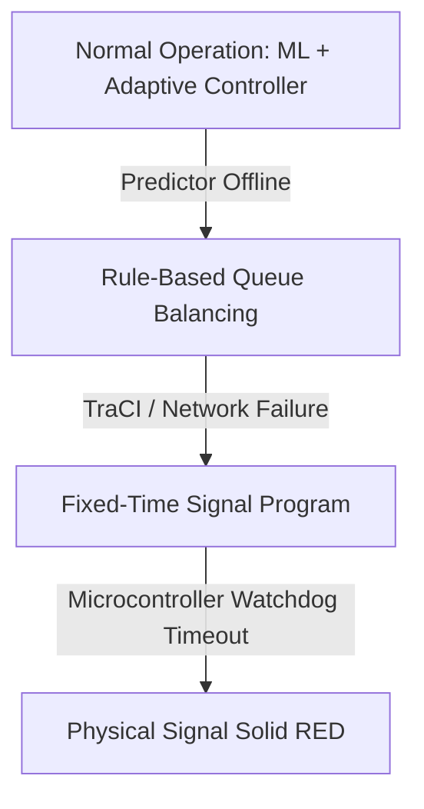

# Responsible AI & Safety Framework — SmartTrafficAI

## 1. Ethical Intent and Safety Principles
SmartTrafficAI is developed as an intelligent traffic management and life-safety support system. In mission-critical urban environments, automated algorithmic decisions directly impact civilian safety, emergency transit efficacy, and public infrastructure reliability.

---

## 2. Core Safety Pillars

### 2.1. Fail-Safe Architectural Hierarchy
The system enforces a tiered fallback hierarchy:
1. **Tier 1 (Intelligent Adaptive + Emergency Priority)**: Active when ML predictions, real-time loop detectors, TraCI controller, and communication channels operate nominally.
2. **Tier 2 (Rule-Based Queue Balancing)**: Engaged automatically if the ML prediction module becomes unavailable or out-of-distribution inputs are detected.
3. **Tier 3 (Fixed-Time Signal Control Fallback)**: Immediate fallback if software exception, sensor failure, or TraCI communication failure occurs. Traffic light programs default to standard deterministic cycles.
4. **Tier 4 (Hardware Watchdog Fallback)**: If the serial bridge disconnects or times out for $\ge 60$ seconds, the Arduino Uno firmware automatically forces all physical outputs to solid **RED** to prevent conflicting vehicle flow.

### 2.2. Human Operator Oversight (Human-in-the-Loop)
* Municipal traffic control center operators retain unilateral manual override capabilities at all times.
* Any automated green corridor or adaptive phase shift can be preempted, extended, or cancelled via the central operator interface.
* Emergency corridor requests require cryptographic verification from authenticated emergency dispatch centers before activation.

### 2.3. Prevention of Unsafe Conflicting Signals
* Under no circumstances can conflicting signal groups simultaneously receive green indications.
* Phase transitions are strictly validated against the signal logic matrix defined in the SUMO network definition.
* Yellow clearance intervals ($T_{yellow} = 3\text{ s}$) are hard-coded and cannot be bypassed, ensuring intersections are physically cleared before orthogonal traffic is released.

---

## 3. Failure Mode and Risk Analysis

| Risk / Failure Mode | Root Cause | Impact | Mitigation Mechanism |
| :--- | :--- | :--- | :--- |
| **False Positive Detection** | Erroneous GPS transponder trigger or sensor glitch | Unnecessary signal preemption; minor side-street queuing | Confirmation handshake with municipal dispatch; auto-timeout after 120s if no vehicle arrives. |
| **False Negative Detection** | Transponder failure or camera occlusion | Ambulance experiences standard queue delay | Manual operator button trigger; secondary inductive loop detection. |
| **Simultaneous Conflict** | Two ambulances approach same junction orthogonally | Potential cross-corridor collision if both given green | Deterministic Priority Manager queues lower-priority ambulance; only one green granted at a time. |
| **Serial Disconnection** | USB cable dislodged / port failure | Controller unable to actuate physical LEDs | Software logs warning and continues simulation; Arduino watchdog falls back to safe RED. |
| **Distribution Shift in ML** | Extreme weather, accidents, or holidays | Prediction error increases | Confidence bounding; fallback to instant inductive queue counts if ML residual exceeds threshold. |

---

## 4. Limitations and Academic Disclaimers

### 4.1. Simulation vs. Real-World Gap
* All multi-junction and emergency tests were evaluated inside the Eclipse SUMO microscopic simulator.
* SUMO assumes perfect driver compliance and standard vehicle deceleration curves. In real-world urban roads, non-compliant pedestrians, illegal turns, and driver behavior introduce stochastic dynamics not modeled in simulation.

### 4.2. Regulatory and Deployment Prerequisites
* Commercial or municipal road deployment requires:
  1. Formal certification by municipal traffic management authorities (e.g., Pune Traffic Police / NHAI).
  2. Compliance with Indian Road Congress (IRC:SP:72) and international signal safety standards.
  3. Hardware-in-the-loop (HIL) testing with certified traffic light controllers (e.g., NEMA TS2, 2070, or standard 230V AC signal cabinets).
  4. Encrypted Dedicated Short-Range Communications (DSRC) / C-V2X vehicle transponders.
