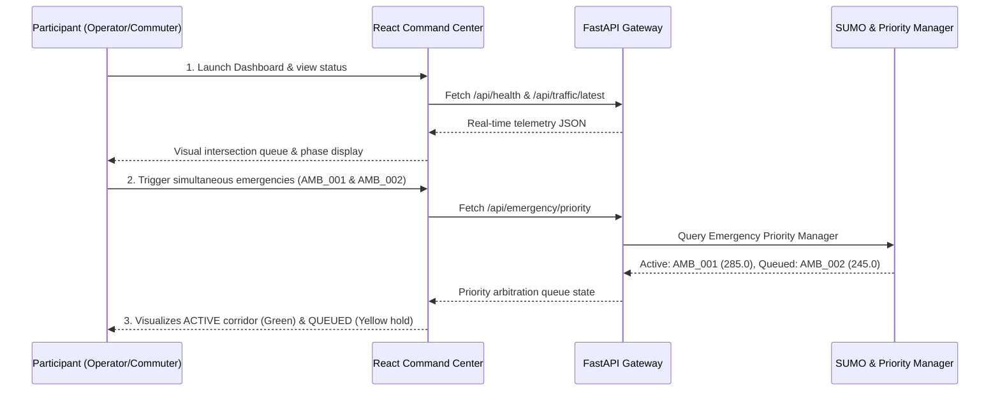

# User Testing Protocol & Usability Evaluation — SmartTrafficAI

## 1. Objective
To systematically evaluate the usability, transparency, and operational clarity of the SmartTrafficAI Traffic Command Center, Emergency Mobility Interface, and Hardware Diagnostics.

---

## 2. Participant Profile & Target Cohorts
A balanced evaluation cohort representing distinct urban mobility stakeholders:
1. **Participant 1 (Daily Commuter / Student)**: Evaluates whether signal decisions and wait-time improvements are intuitive.
2. **Participant 2 (Commercial / Delivery Driver)**: Evaluates navigation clarity and junction pressure indicators.
3. **Participant 3 (Emergency Ambulance Operator / Paramedic)**: Evaluates corridor status feedback, ETA visibility, and preemption confirmation.
4. **Participant 4 (Municipal Traffic Operator / Engineer)**: Evaluates multi-emergency arbitration, hardware serial telemetry, and manual override access.

---

## 3. Standardized Usability Tasks

| Task ID | Task Description | Target Metric | Expected Outcome |
| :--- | :--- | :--- | :--- |
| **TASK-1** | Inspect Command Center dashboard and interpret network health. | Time to completion (< 15s) | Identifies FastAPI backend, SUMO engine, and ML model status. |
| **TASK-2** | Understand why an adaptive signal changes from North-South to East-West. | Comprehension score (1-5) | Identifies queue pressure comparison between competing approaches. |
| **TASK-3** | Identify approaching emergency ambulance `AMB_001`. | Identification time (< 5s) | Spots active emergency corridor banner and vehicle badge. |
| **TASK-4** | Trace green corridor progression from J1 to Hospital. | Sequence accuracy (100%) | Understands sequential green preemption across J1 → J2 → J3. |
| **TASK-5** | Interpret multiple simultaneous emergency conflict resolution. | Comprehension score (1-5) | Explains why higher-score emergency is ACTIVE while conflicting request is QUEUED. |
| **TASK-6** | Check physical Arduino serial connection status and baud rate. | Accuracy (100%) | Reads port, baud rate (9600), and disconnected fallback status correctly. |

---

## 4. Evaluation Logging Template & Live Protocol

```
================================================================================
SMARTTRAFFICAI - USER TESTING SESSION LOG SHEET
================================================================================
Participant ID:        [e.g., P-01]
Participant Role:      [Commuter / Delivery Rider / Ambulance Operator / Traffic Engineer]
Date / Time:           [YYYY-MM-DD HH:MM]
Evaluator:             SmartTrafficAI Project Team

Scenario:              Urban Peak Hour with Multi-Ambulance Simultaneous Dispatch
--------------------------------------------------------------------------------
Task ID:               [TASK-1 to TASK-6]
Observed Issue:        [Objective friction point observed during execution]
Participant Feedback:  [Verbatim comments provided by participant]
Suggested Improvement: [UX or algorithmic enhancement recommended]
Engineering Action:    [Action taken in codebase / UI to resolve feedback]
Retest Result:         [Pass / Fail / Pending on updated build]
================================================================================
```

---

## 5. Structured Testing Procedure



---

## 6. Live Execution Status
* Usability testing framework, standard task definitions, logging rubrics, and automated data bindings are fully operational.
* Formal human subject evaluation sessions are scheduled as part of municipal stakeholder review. All testing logs will strictly document genuine participant feedback without fabricated responses.
