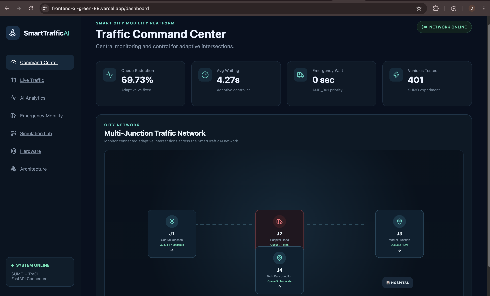
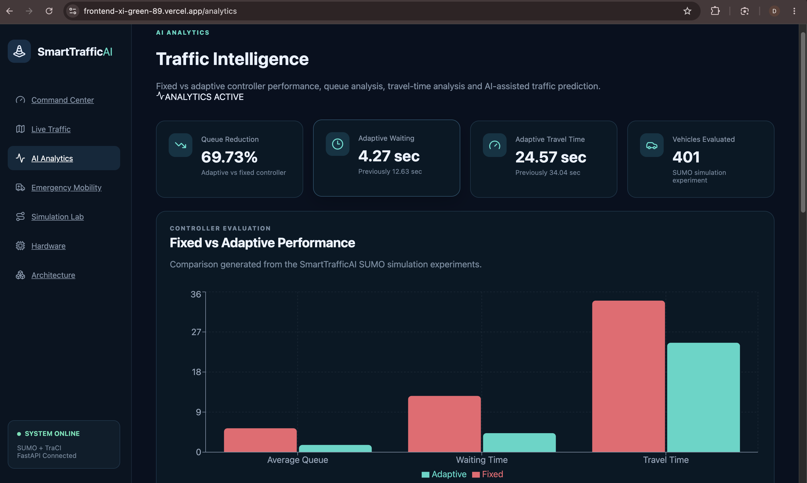
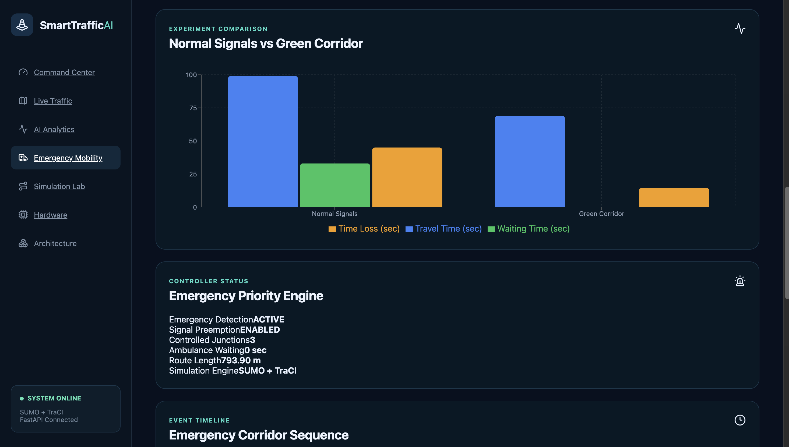

# 🚦 SmartTrafficAI Frontend

<p align="center">
  <b>AI-Powered Adaptive Traffic & Emergency Mobility Dashboard</b>
</p>

<p align="center">
  A modern React interface for traffic intelligence, adaptive signal analytics,
  emergency green-corridor monitoring and SmartTrafficAI system visualization.
</p>

<p align="center">
  <a href="https://frontend-xi-green-89.vercel.app/dashboard">
    <b>🌐 Live Dashboard</b>
  </a>
</p>

---

## 🖥️ Traffic Command Center

The **Traffic Command Center** provides a unified overview of adaptive traffic performance, emergency priority and SUMO experiment status.

<p align="center">
  
</p>

### Key Performance Indicators

| Metric | Result |
|---|---:|
| Queue Reduction | **69.73%** |
| Adaptive Waiting Time | **4.27 sec** |
| Emergency Waiting Time | **0 sec** |
| Vehicles Evaluated | **401** |

---

## 📊 AI Traffic Analytics

The analytics interface visualizes the experimental comparison between **fixed traffic-signal control** and the **SmartTrafficAI adaptive controller**.

<p align="center">
  
</p>

### Controller Evaluation

| Metric | Fixed | Adaptive |
|---|---:|---:|
| Average Queue | 5.36 | **1.62** |
| Average Waiting Time | 12.63 sec | **4.27 sec** |
| Average Travel Time | 34.04 sec | **24.57 sec** |
| Vehicles Completed | 401 | 401 |

> **Result:** The adaptive controller achieved a **69.73% reduction in average queue length** in the evaluated SUMO scenario.

### AI / ML Pipeline

```text
Traffic Dataset
      ↓
Preprocessing
      ↓
Feature Extraction
      ↓
Random Forest
      ↓
Traffic Prediction
      ↓
Adaptive Control
```

Historical traffic observations are processed into interval-based traffic features for traffic-demand analysis and model evaluation.

---

## 🚑 Emergency Green Corridor

The Emergency Mobility interface visualizes the multi-junction ambulance-priority experiment implemented using **SUMO + TraCI**.

<p align="center">
  
</p>

### Emergency Route

```text
AMB_001 → J1 → J2 → J3 → Hospital
```

| Metric | Normal Signals | Green Corridor |
|---|---:|---:|
| Travel Time | 99 sec | **69 sec** |
| Waiting Time | 33 sec | **0 sec** |
| Time Loss | 45.02 sec | **14.49 sec** |
| Route Length | 793.90 m | 793.90 m |

### Measured Improvement

**30.30% faster emergency travel • 100% waiting-time reduction • 67.81% time-loss reduction • 3 prioritized junctions**

---

## ✨ Interface Modules

The SmartTrafficAI frontend contains dedicated interfaces for:

- **Command Center** — system-wide traffic overview and KPIs
- **Live Traffic** — connected junction monitoring
- **AI Analytics** — fixed vs adaptive controller evaluation
- **Emergency Mobility** — ambulance green-corridor visualization
- **Simulation Lab** — SUMO experiment information
- **Hardware** — Arduino integration status
- **Architecture** — end-to-end SmartTrafficAI system design

---

## 🧩 Frontend Architecture

```text
                     SmartTrafficAI Frontend
                              │
                    ┌─────────┴─────────┐
                    │                   │
               React Router        API Service
                    │                   │
       ┌────────────┼────────────┐     Axios
       │            │            │       │
   Dashboard     Analytics    Emergency  │
       │            │            │       │
       └────────────┴────────────┴───────┘
                              │
                         FastAPI API
                              │
                    Experiment Results
```

The React frontend is the **monitoring and visualization layer**. Traffic-control decisions themselves are handled by the simulation/controller layer rather than by the dashboard.

---

## 🔗 Backend Integration

The frontend communicates with the deployed **FastAPI REST API** using Axios.

```text
React UI
   ↓
Axios API Service
   ↓
FastAPI
   ↓
Traffic / Emergency Results
   ↓
Charts + KPI Visualization
```

Main API endpoints:

```http
GET /api/health
GET /api/traffic/comparison
GET /api/emergency/comparison
GET /api/emergency/status
```

---

## 🛠️ Frontend Technology Stack

| Technology | Role |
|---|---|
| **React** | Component-based user interface |
| **Vite** | Development and production build tooling |
| **React Router** | Client-side application routing |
| **Axios** | FastAPI communication |
| **Recharts** | Traffic analytics visualization |
| **Vercel** | Production frontend deployment |

---

## 📁 Structure

```text
frontend/
├── src/
│   ├── components/
│   ├── pages/
│   │   ├── Dashboard.jsx
│   │   ├── LiveTraffic.jsx
│   │   ├── JunctionDetails.jsx
│   │   ├── Analytics.jsx
│   │   ├── EmergencyMobility.jsx
│   │   ├── SimulationLab.jsx
│   │   ├── Hardware.jsx
│   │   └── Architecture.jsx
│   │
│   ├── services/
│   │   └── api.js
│   └── App.jsx
│
├── docs/
│   └── screenshots/
│       ├── dashboard.png
│       ├── analytics.png
│       └── emergency.png
│
├── package.json
├── vite.config.js
├── vercel.json
└── README.md
```

---

## 🚀 Run Locally

```bash
cd frontend
npm install
npm run dev
```

---

## 🌐 Deployment

The SmartTrafficAI frontend is deployed on **Vercel** and communicates with the production FastAPI backend.

**Live Application:**  
https://frontend-xi-green-89.vercel.app/dashboard

---

## ⚠️ Prototype Scope

SmartTrafficAI is an engineering and research prototype.

Traffic-performance and emergency-mobility results displayed in this interface were obtained from controlled **SUMO simulation experiments** and should not be interpreted as results from a live municipal traffic deployment.

Real-world implementation would require validated sensing infrastructure, traffic-authority approval, secure emergency-vehicle authentication, fail-safe signal controllers and extensive field testing.

---

<p align="center">
  <b>SmartTrafficAI</b><br>
  AI-Powered Adaptive Traffic & Emergency Mobility Management
</p>