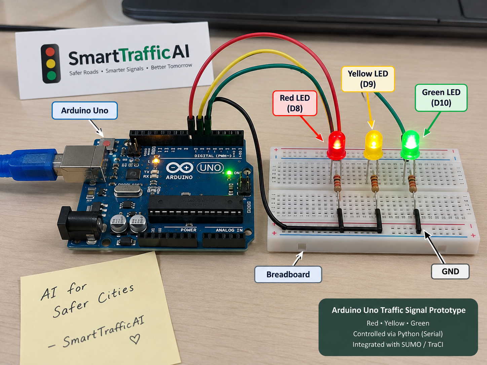

# 🔌 SmartTrafficAI — Hardware Prototype

<p align="center">
  <b>Arduino Uno Based Intelligent Traffic Signal Prototype</b>
</p>

<p align="center">
  Physical actuation layer for SmartTrafficAI, designed to translate
  SUMO/TraCI traffic-control decisions into miniature traffic-signal outputs.
</p>

---

## 🚦 Hardware Prototype

SmartTrafficAI includes an **Arduino Uno based traffic-signal prototype** representing the physical actuation layer of the proposed intelligent traffic-management system.

<p align="center">
  
</p>

<p align="center">
  <b>Arduino Uno Traffic Signal Prototype — Red, Yellow & Green LED Control</b>
</p>

The prototype demonstrates how traffic-control commands generated by the software layer can be mapped to physical traffic-signal outputs.

### Hardware Components

- Arduino Uno
- Breadboard
- Red LED
- Yellow LED
- Green LED
- Current-limiting resistors
- Jumper wires
- USB serial communication interface

---

# 🏗️ Hardware Architecture

The Arduino prototype is connected conceptually to the same control pipeline used by the SmartTrafficAI simulation.

```text
Traffic Scenario
      ↓
SUMO Simulation
      ↓
TraCI
      ↓
Python Traffic Controller
      ↓
Hardware Command Layer
      ↓
Python Serial Bridge
      ↓
USB Serial
      ↓
Arduino Uno
      ↓
┌────────┬─────────┬────────┐
│        │         │
▼        ▼         ▼
RED    YELLOW    GREEN
LED      LED       LED
```

The **React dashboard is used for monitoring and visualization**.

Physical signal commands originate from the Python controller layer rather than directly from the frontend.

---

# 🔧 Arduino Pin Configuration

The prototype uses three Arduino digital output pins.

| Traffic Signal | Arduino Pin |
|---|---:|
| 🔴 Red | **D8** |
| 🟡 Yellow | **D9** |
| 🟢 Green | **D10** |
| Ground | **GND** |

Conceptual circuit:

```text
D8  ── Resistor ── Red LED
D9  ── Resistor ── Yellow LED
D10 ── Resistor ── Green LED

LED Cathodes ───── Common GND
```

Each LED uses its own current-limiting resistor.

---

# 💻 Arduino Firmware

Arduino firmware is maintained at:

```text
hardware/arduino/smart_traffic_signal.ino
```

The firmware is responsible for:

- Initializing the traffic-signal pins
- Receiving commands through serial communication
- Switching between traffic-light states
- Supporting emergency-priority commands
- Returning the signal to a safe state when required

### Supported Signal Commands

```text
RED
YELLOW
GREEN
EMERGENCY_GREEN
ALL_OFF
```

Conceptually:

```text
Serial Command
      ↓
Arduino Firmware
      ↓
Command Parser
      ↓
Traffic Signal State
      ↓
LED Output
```

For example:

```cpp
if (command == "RED") {
    setSignal(true, false, false);
}
else if (command == "GREEN") {
    setSignal(false, false, true);
}
else if (command == "EMERGENCY_GREEN") {
    setSignal(false, false, true);
}
```

---

# 🔗 Python Serial Bridge

The communication interface between SmartTrafficAI and the Arduino is implemented in:

```text
hardware/python/serial_bridge.py
```

The serial bridge translates controller decisions into commands that can be understood by the Arduino firmware.

```text
Python Controller
       ↓
serial_bridge.py
       ↓
PySerial
       ↓
USB Serial
       ↓
Arduino Uno
```

The bridge is designed to:

- Detect an available serial device
- Establish serial communication
- Send normal traffic-signal commands
- Send emergency-priority commands
- Support simulation-only execution when hardware is unavailable

---

# 🛡️ Simulation-Only Fallback

The physical Arduino is not required for SmartTrafficAI's SUMO experiments to operate.

If a serial hardware connection is unavailable, the bridge safely continues in **simulation-only mode**.

Conceptually:

```text
Traffic Controller
        ↓
Serial Bridge
        ↓
Is Arduino Available?
      /           \
    YES            NO
     ↓              ↓
Send Serial     Log Command
Command         & Continue
     ↓              ↓
Arduino          SUMO Simulation
```

This allows the AI traffic-control experiment to remain independent of hardware availability.

---

# 🚑 Emergency Green Corridor Integration

The hardware command layer is integrated into the SmartTrafficAI multi-junction emergency controller.

The simulated ambulance follows:

```text
AMB_001
   ↓
  J1
   ↓
  J2
   ↓
  J3
   ↓
Hospital
```

As the ambulance progresses through the corridor, the controller generates corresponding emergency traffic-signal commands.

### Emergency Command Sequence

```text
AMB_001 Detected
       ↓
J1 Priority Activated
       ↓
EMERGENCY_GREEN
       ↓
J2 Priority Activated
       ↓
EMERGENCY_GREEN
       ↓
J3 Priority Activated
       ↓
EMERGENCY_GREEN
       ↓
Hospital Approach
       ↓
GREEN
       ↓
Emergency Corridor Completed
       ↓
RED
```

The software-side mapping between the **SUMO/TraCI emergency controller and hardware command layer has been validated**.

---

# 🔄 Complete SmartTrafficAI Integration

```text
                     Traffic Data
                          ↓
                    AI / Decision
                          ↓
                    SUMO + TraCI
                          ↓
                  Python Controller
                     /          \
                    /            \
                   ▼              ▼
           Experiment Data    Serial Bridge
                  ↓               ↓
               FastAPI        Arduino Uno
                  ↓               ↓
          React Dashboard    Traffic LEDs
```

This architecture separates:

- **Simulation**
- **Decision logic**
- **Monitoring**
- **Physical actuation**

into independent layers.

---

# 📁 Hardware Directory

```text
hardware/
│
├── arduino/
│   └── smart_traffic_signal.ino
│
├── python/
│   └── serial_bridge.py
│
├── docs/
│   └── images/
│       └── arduino-prototype.png
│
└── README.md
```

---

# 🛠️ Technology Stack

| Technology | Role |
|---|---|
| **Arduino Uno** | Physical signal controller |
| **Arduino C/C++** | Embedded traffic-light firmware |
| **Python** | Controller integration |
| **PySerial** | Serial communication |
| **SUMO** | Microscopic traffic simulation |
| **TraCI** | Runtime traffic and signal control |
| **Breadboard** | Prototype circuit |
| **LEDs** | Physical traffic-signal representation |

---

# 📋 Implementation Status

| Component | Status |
|---|---|
| Arduino firmware | ✅ Implemented |
| Red / Yellow / Green control logic | ✅ Implemented |
| Emergency green command | ✅ Implemented |
| Python serial bridge | ✅ Implemented |
| SUMO/TraCI hardware command layer | ✅ Implemented |
| J1 → J2 → J3 emergency mapping | ✅ Software-side validated |
| Physical Arduino circuit | 🟡 Assembled |
| End-to-end USB serial validation | ⏳ Pending |

---

# 🧪 Software-Side Hardware Validation

The integrated emergency controller has been executed with the serial bridge enabled.

When physical serial hardware is unavailable, SmartTrafficAI records the intended hardware commands while continuing the SUMO simulation.

The validated command progression includes:

```text
J1 → EMERGENCY_GREEN
J2 → EMERGENCY_GREEN
J3 → EMERGENCY_GREEN
Hospital → GREEN
Corridor Complete → RED
```

This verifies the software path:

```text
SUMO
  ↓
TraCI
  ↓
Emergency Controller
  ↓
Serial Bridge
  ↓
Hardware Command
```

without claiming successful physical Arduino actuation.

---

# ⚠️ Physical Validation Status

The Arduino Uno traffic-light circuit has been assembled and the required firmware and communication software have been prepared.

At the current prototype stage, **final end-to-end physical USB serial validation remains pending**.

The development Mac requires a compatible USB-C interface for the Arduino connection before the complete physical communication path can be tested.

Therefore:

> **The software-side Arduino integration is implemented and validated, while final physical USB serial actuation remains a pending prototype validation step.**

This distinction ensures that simulation results and hardware validation status are reported accurately.

---

# 🔮 Final Physical Validation Workflow

The remaining validation process is:

```text
Connect Arduino Uno
        ↓
Upload Firmware
        ↓
Test RED / YELLOW / GREEN
        ↓
Connect Python Serial Bridge
        ↓
Verify Serial Commands
        ↓
Start SUMO Simulation
        ↓
Detect AMB_001
        ↓
Activate J1 → J2 → J3 Priority
        ↓
Observe Physical LED Response
        ↓
Validate End-to-End Integration
```

---

# 🚀 Future Hardware Extension

The current miniature prototype can later be expanded into a larger experimental system using:

- Multiple Arduino-controlled intersections
- Validated traffic sensors
- Camera-based traffic observation
- Edge AI processing
- Secure emergency-vehicle identification
- Vehicle-to-infrastructure communication
- Fail-safe traffic-signal control
- Real-time roadside communication

Such extensions would require additional safety validation before any real-world deployment.

---

# 🛡️ Prototype & Safety Scope

SmartTrafficAI is an **educational and experimental prototype**.

The Arduino circuit represents a miniature traffic signal and is **not connected to a real road traffic-control system**.

Real deployment would require certified signal controllers, traffic-authority approval, secure communications, fail-safe mechanisms, calibrated sensing, extensive field testing and safety certification.

---

<p align="center">
  <b>SmartTrafficAI Hardware Layer</b><br><br>
  Arduino Uno • Python • PySerial • SUMO • TraCI
  <br><br>
  <i>From intelligent traffic decisions to physical signal actuation.</i>
</p>