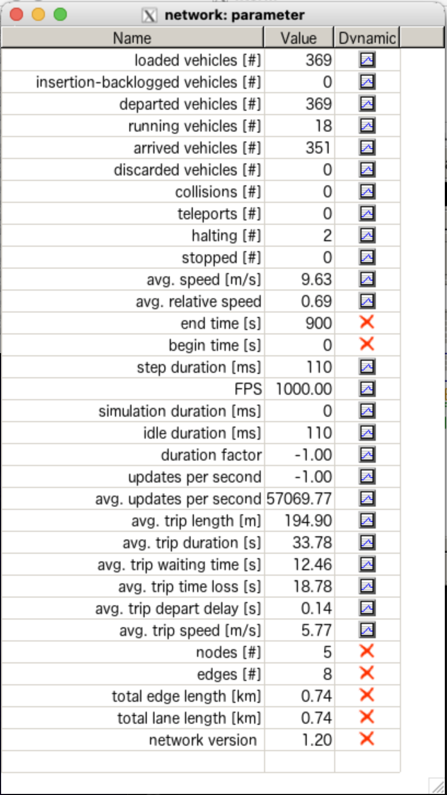
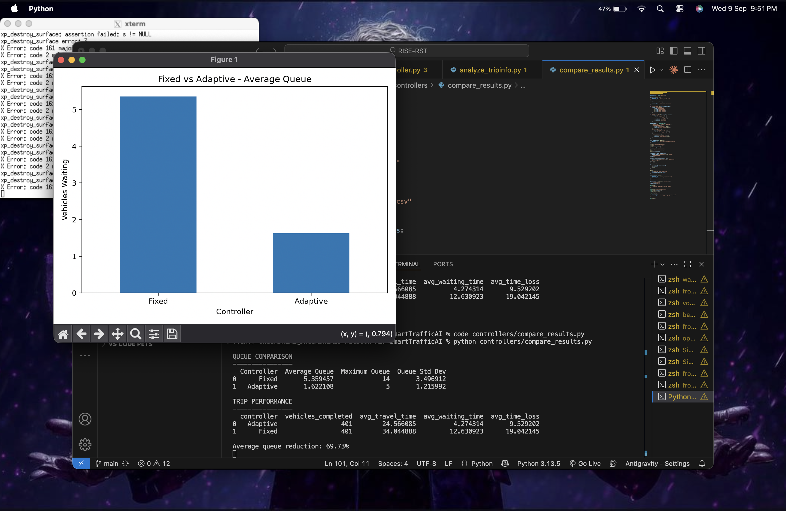
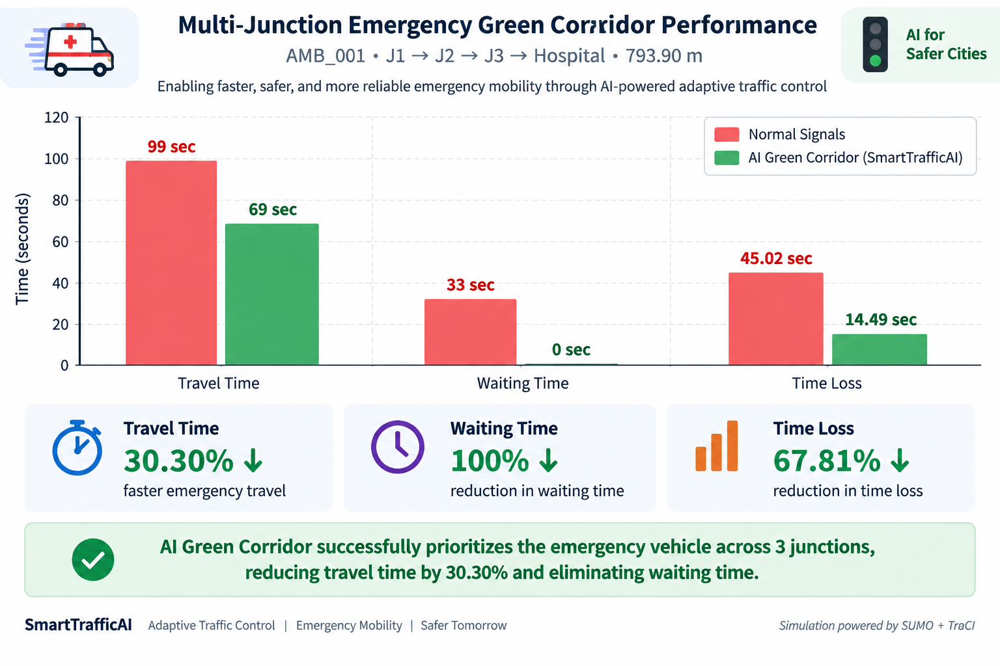

# 🚦 SmartTrafficAI — SUMO Traffic Simulation

<p align="center">
  <b>Adaptive Traffic Signal Control & Multi-Junction Emergency Green Corridor</b>
</p>

<p align="center">
  Microscopic traffic simulation and intelligent signal-control experiments
  implemented using SUMO, TraCI and Python.
</p>

---

## 🎯 Simulation Overview

The simulation layer is the experimental core of **SmartTrafficAI**.

It provides a controlled environment for evaluating:

- Fixed traffic-signal control
- Adaptive queue-responsive signal control
- Traffic queue and waiting-time performance
- Emergency vehicle priority
- Multi-junction ambulance green-corridor operation
- TraCI-based traffic-light control
- Hardware command integration

The simulation results are subsequently exposed through the FastAPI backend and visualized in the React dashboard.

```text
Traffic Demand
      ↓
SUMO Road Network
      ↓
Vehicle Simulation
      ↓
TraCI Monitoring
      ↓
Adaptive / Emergency Controller
      ↓
Signal Phase Decision
      ↓
Performance Metrics
      ↓
FastAPI → React Dashboard
```

---

# 🧪 SUMO Simulation Environment

SmartTrafficAI uses **SUMO (Simulation of Urban MObility)** as the microscopic traffic simulation engine.

The simulated environment allows traffic-control strategies to be evaluated without interacting with a real municipal traffic network.

<p align="center">
  
</p>

<p align="center">
  <b>SUMO Simulation Environment — Vehicle and Network Statistics</b>
</p>

The simulation tracks parameters such as:

- Loaded and departed vehicles
- Running and arrived vehicles
- Halting vehicles
- Average vehicle speed
- Trip duration
- Waiting time
- Time loss
- Traffic-network statistics

---

# 🧠 Fixed vs Adaptive Signal Control

Two traffic-control strategies were evaluated under the SmartTrafficAI SUMO experiment.

### Fixed Controller

The fixed controller follows predefined traffic-light timing regardless of current traffic demand.

```text
Fixed Timing
     ↓
Predetermined Signal Phases
     ↓
Traffic Movement
```

### Adaptive Controller

The adaptive controller uses current traffic conditions obtained through **TraCI** to modify traffic-light operation according to observed demand.

```text
SUMO Traffic State
        ↓
TraCI
        ↓
Queue Observation
        ↓
Adaptive Decision Logic
        ↓
Signal Phase Adjustment
```

---

## 📊 Adaptive Controller Performance

<p align="center">
  
</p>

<p align="center">
  <b>Fixed vs Adaptive Controller — SUMO Experiment</b>
</p>

### Experimental Results

| Metric | Fixed Controller | Adaptive Controller |
|---|---:|---:|
| Average Queue | 5.36 | **1.62** |
| Maximum Queue | 14 | **5** |
| Average Waiting Time | 12.63 sec | **4.27 sec** |
| Average Travel Time | 34.04 sec | **24.57 sec** |
| Average Time Loss | 19.04 sec | **9.53 sec** |
| Vehicles Completed | 401 | 401 |

### 🚦 Queue Reduction

The average queue decreased from:

```text
5.36 vehicles → 1.62 vehicles
```

resulting in approximately:

# **69.73% Average Queue Reduction**

This result was obtained in the evaluated SmartTrafficAI SUMO simulation scenario.

---

# 🚑 Multi-Junction Emergency Green Corridor

SmartTrafficAI also implements an emergency-priority controller for an ambulance travelling through multiple controlled intersections.

The implemented emergency route is:

```text
AMB_001
   │
   ▼
  J1
   │
   ▼
  J2
   │
   ▼
  J3
   │
   ▼
Hospital
```

**Route length: 793.90 metres**

When the ambulance progresses through the corridor, the TraCI controller sequentially activates priority at the upcoming junctions.

```text
Ambulance Detected
        ↓
J1 Priority Green
        ↓
J2 Priority Green
        ↓
J3 Priority Green
        ↓
Hospital Approach
        ↓
Normal Operation Restored
```

---

## 📈 Green Corridor Performance

<p align="center">
  
</p>

<p align="center">
  <b>AMB_001 — J1 → J2 → J3 → Hospital</b>
</p>

### Experiment Results

| Metric | Normal Signals | AI Green Corridor |
|---|---:|---:|
| Travel Time | 99 sec | **69 sec** |
| Waiting Time | 33 sec | **0 sec** |
| Time Loss | 45.02 sec | **14.49 sec** |
| Route Length | 793.90 m | 793.90 m |
| Controlled Junctions | 3 | 3 |

### Measured Improvements

**🚑 Travel Time**

```text
99 sec → 69 sec
```

**30.30% reduction**

**⏱️ Waiting Time**

```text
33 sec → 0 sec
```

**100% reduction**

**📉 Time Loss**

```text
45.02 sec → 14.49 sec
```

**67.81% reduction**

---

# ⚙️ Emergency Priority Logic

The green-corridor controller communicates with SUMO through TraCI.

Conceptually:

```python
Ambulance detected
        ↓
Identify upcoming junction
        ↓
Determine corridor green phase
        ↓
Set traffic-light priority
        ↓
Track ambulance movement
        ↓
Transfer priority to next junction
        ↓
Restore normal operation
```

For the implemented corridor:

```text
W → J1 → J2 → J3 → Hospital
```

the controller prioritizes the ambulance sequentially rather than permanently forcing every signal green.

---

# 🔌 Hardware Command Integration

The emergency controller is also connected to the SmartTrafficAI hardware-command layer.

```text
SUMO
  ↓
TraCI
  ↓
Python Emergency Controller
  ↓
Serial Bridge
  ↓
Arduino Uno
  ↓
Traffic Signal LEDs
```

During the integrated software test, the controller generated commands corresponding to the ambulance's progression through the corridor:

```text
AMB_001 detected
      ↓
J1 → EMERGENCY_GREEN
      ↓
J2 → EMERGENCY_GREEN
      ↓
J3 → EMERGENCY_GREEN
      ↓
Hospital approach → GREEN
      ↓
Corridor completed → RED
```

The software-side SUMO → TraCI → serial-command mapping has been validated.

The physical Arduino traffic-light circuit has been assembled, while final end-to-end USB serial hardware validation remains pending.

---

# 📁 Simulation Structure

```text
simulation/
│
├── sumo/
│   ├── network/
│   ├── routes/
│   ├── configs/
│   └── outputs/
│
├── sumo_multi/
│   ├── network/
│   │   ├── corridor.nod.xml
│   │   ├── corridor.edg.xml
│   │   └── corridor.net.xml
│   │
│   ├── routes/
│   │   └── corridor.rou.xml
│   │
│   ├── configs/
│   │   └── corridor.sumocfg
│   │
│   └── outputs/
│       ├── corridor_tripinfo.xml
│       └── green_corridor_tripinfo.xml
│
├── docs/
│   └── screenshots/
│       ├── adaptive-comparison.png
│       ├── sumo-simulation.png
│       └── green-corridor.png
│
└── README.md
```

The Python control scripts are maintained in the project-level `controllers/` directory.

---

# 🧩 Controller Layer

Important SmartTrafficAI controller scripts include:

```text
controllers/
├── fixed_controller.py
├── adaptive_controller.py
├── emergency_controller.py
├── green_corridor_controller.py
├── compare_results.py
├── compare_ambulance.py
├── analyze_tripinfo.py
├── check_ambulance.py
└── inspect_signal.py
```

### Fixed Controller

Provides the baseline signal-control strategy.

### Adaptive Controller

Observes traffic conditions and adjusts signal operation using TraCI.

### Emergency Controller

Evaluates emergency-vehicle priority logic.

### Green Corridor Controller

Coordinates sequential emergency priority across:

```text
J1 → J2 → J3
```

---

# 🔬 Experimental Pipeline

```text
        Traffic Scenario
               │
               ▼
        SUMO Simulation
               │
               ▼
          TraCI Interface
               │
        ┌──────┴──────┐
        │             │
        ▼             ▼
 Fixed Controller   Adaptive Controller
        │             │
        └──────┬──────┘
               ▼
       Performance Results
               │
               ▼
 Queue / Waiting / Travel
               │
               ▼
       CSV Result Storage
               │
               ▼
           FastAPI
               │
               ▼
       React Dashboard
```

Emergency experiments use an additional priority path:

```text
AMB_001
   ↓
Emergency Detection
   ↓
Green Corridor Controller
   ↓
J1 → J2 → J3
   ↓
Hospital
```

---

# 📦 Experiment Outputs

Important result files are stored in the project `results/` directory.

```text
results/
├── adaptive_results.csv
├── ambulance_comparison.csv
├── green_corridor_comparison.csv
├── queue_comparison.csv
├── trip_metrics_comparison.csv
└── hardware_integration_test.txt
```

These results are used for analysis, API responses and dashboard visualization.

---

# 🛠️ Technology Stack

| Technology | Purpose |
|---|---|
| **SUMO** | Microscopic road-traffic simulation |
| **TraCI** | Runtime traffic-light and vehicle control |
| **Python** | Controller and experiment logic |
| **Pandas** | Result processing and analysis |
| **Matplotlib** | Experiment visualization |
| **XML** | SUMO network, routes and output configuration |
| **FastAPI** | Exposure of experiment results |
| **React** | Visualization of simulation analytics |

---

# ▶️ Running the Simulation

From the SmartTrafficAI project root, activate the Python environment first.

Example:

```bash
cd /Users/dheekshika/Desktop/SmartTrafficAI
source venv/bin/activate
```

Run the adaptive controller:

```bash
python controllers/adaptive_controller.py
```

Run the multi-junction emergency green corridor:

```bash
python controllers/green_corridor_controller.py
```

The generated experiment outputs can then be analysed and exposed through the backend API.

---

# 🛡️ Responsible Simulation & Limitations

SmartTrafficAI is currently a **prototype evaluated in a controlled SUMO simulation environment**.

The results documented here should **not** be interpreted as measured improvements from a live municipal traffic network.

Real-world traffic deployment would require:

- Validated roadside sensing
- Traffic-authority approval
- Fail-safe signal controllers
- Secure emergency-vehicle authentication
- Communication reliability testing
- Hardware validation
- Large-scale traffic calibration
- Field trials and safety evaluation

SUMO allows the control strategy to be evaluated safely before any potential real-world deployment.

---

<p align="center">
  <b>SmartTrafficAI Simulation Engine</b><br>
  SUMO • TraCI • Adaptive Traffic Control • Emergency Green Corridor
</p>